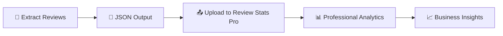

<div align="center">

# 📱 Google Play Reviews Scraper


**🚀 Professional tool to extract and analyze app reviews from Google Play Store**

*Extract thousands of reviews in minutes with a beautiful, modern interface*

---

## 🌍 **Choose Your Language / Escolha seu Idioma**

[](README.md)
[](docs/README_PT.md)
[](docs/README_ES.md)
[](docs/README_FR.md)
[](docs/README_DE.md)
[](docs/README_IT.md)

---

[](https://python.org)
[](LICENSE)
[](https://github.com)
[](src/app_gui.py)

**[🎬 See Demo](#-demo) • [⚡ Quick Start](#-quick-start) • [📖 Features](#-features) • [🛠️ Installation](#️-installation)**

---

</div>

## 🎬 Demo

<div align="center">

### 🖥️ Modern Interface
*Beautiful, intuitive GUI with multi-language support*


### ⚡ Application in Action
*See the scraper working with real-time progress*


### 📊 Command Line Interface
*Also available via terminal for automation*


</div>

---

## ⚡ Quick Start

### 🖥️ **Platform Compatibility**

| Platform | GUI Interface | Command Line | Notes |
|:--------:|:-------------:|:------------:|:------|
| 🪟 **Windows** | ✅ Full Support | ✅ Supported | Modern GUI with all features |
| 🍎 **macOS** | ✅ Native Interface | ✅ Supported | Optimized for macOS design |
| 🐧 **Linux** | ⚠️ Basic GUI | ✅ Supported | GUI available but CLI recommended |

### 🎯 **Option 1: GUI Application (Recommended)**

#### **🪟 Windows Users**
```bash
# 1. Clone the repository
git clone https://github.com/dssiqueira/google-play-reviews-scraper.git
cd google-play-reviews-scraper

# 2. Install dependencies
pip install -r requirements.txt

# 3. Launch Windows GUI
python src/app_gui.py
```

#### **🍎 macOS Users**
```bash
# 1. Clone the repository
git clone https://github.com/dssiqueira/google-play-reviews-scraper.git
cd google-play-reviews-scraper

# 2. Install dependencies
pip install -r requirements.txt

# 3. Launch macOS native interface
python src/app_gui_mac.py
```

**✨ macOS Features:**
- 🎨 **Native macOS design** with SF Pro fonts
- 🖱️ **Trackpad support** and native scroll
- 📁 **Finder integration** for easy file access
- 🌍 **6 languages** with automatic locale detection

#### **🐧 Linux Users**
```bash
# 1. Clone the repository
git clone https://github.com/dssiqueira/google-play-reviews-scraper.git
cd google-play-reviews-scraper

# 2. Install dependencies (including tkinter)
sudo apt-get install python3-tk  # Ubuntu/Debian
# or
sudo yum install tkinter          # CentOS/RHEL

pip install -r requirements.txt

# 3. Launch GUI (basic) or use CLI
python src/app_gui.py
```

### 🔧 **Option 2: Command Line**

```bash
# Extract reviews from a single app
python src/review_scraper.py --url "https://play.google.com/store/apps/details?id=com.whatsapp"

# Batch process multiple apps
python src/review_scraper.py --batch apps_list.txt --output results/
```

### 📦 **Option 3: Python Module**

```python
from src.review_scraper import GooglePlayReviewScraper

scraper = GooglePlayReviewScraper()
reviews = scraper.scrape_reviews("com.whatsapp")
print(f"Extracted {len(reviews)} reviews!")
```

---

## 📖 Features

<div align="center">

| 🎯 **Core Features** | 🎨 **Interface** | 📊 **Output** | 🌍 **Multi-Language** |
|:---:|:---:|:---:|:---:|
| Extract **ALL** reviews | Modern GUI with themes | CSV & JSON export | 6 languages supported |
| **Batch processing** | Real-time progress | Detailed analytics | Auto-detect locale |
| **Smart filtering** | Drag & drop URLs | Time statistics | Custom translations |
| **Rate limiting** | Multi-app queue | Error handling | RTL support |

</div>

### 🚀 **What makes it special?**

- **🎯 Complete Extraction**: Gets ALL available reviews, not just recent ones
- **⚡ Lightning Fast**: Optimized scraping with intelligent rate limiting  
- **🎨 Beautiful Interface**: Modern GUI with light/dark themes
- **📊 Rich Analytics**: Detailed statistics and time tracking
- **🔄 Batch Processing**: Handle multiple apps simultaneously
- **🌍 Multi-Language**: Interface available in 6 languages
- **📱 Smart Detection**: Auto-detects app info and handles errors gracefully
- **💾 Multiple Formats**: Export to CSV, JSON with customizable fields
- **🛡️ Robust**: Handles network issues, rate limits, and edge cases

---

## 🛠️ Installation

### 📋 **Requirements**

- **Python 3.7+** (3.9+ recommended)
- **Internet connection** for scraping
- **2GB RAM** minimum (4GB+ for large datasets)

### 📦 **Quick Installation**

#### **🚀 One-Command Install (All Platforms)**
```bash
git clone https://github.com/dssiqueira/google-play-reviews-scraper.git
cd google-play-reviews-scraper
python install.py
```

#### **🔧 Manual Installation**
```bash
git clone https://github.com/dssiqueira/google-play-reviews-scraper.git
cd google-play-reviews-scraper
pip install -r requirements.txt

# Windows
python src/app_gui.py

# macOS  
python src/app_gui_mac.py

# Linux
python src/app_gui.py  # or use CLI
```

---

## 🎨 Interface Versions

### **🪟 Windows Version (`app_gui.py`)**
- **Material Design** inspired interface
- **Multi-language selector** with flag icons
- **Drag & drop** URL support
- **Real-time progress** with detailed statistics
- **Batch processing** queue management
- **Auto-open results** in default applications

### **🍎 macOS Version (`app_gui_mac.py`)**
- **Native macOS design** following Apple HIG
- **SF Pro font** integration
- **Trackpad gestures** support
- **Finder integration** for file operations
- **macOS-style dialogs** and notifications
- **Automatic dark/light mode** detection

### **🐧 Linux Version (`app_gui.py`)**
- **Cross-platform compatibility**
- **Basic but functional** interface
- **Command-line fallback** recommended
- **Lightweight** resource usage

---

## 📈 Advanced Analytics Platform

### 🚀 **Review Stats Pro - Analyze Your Data**

After extracting reviews with this tool, take your analysis to the next level with our **professional analytics platform**:

**🔗 [Review Stats Pro](https://review-stats-pro.lovable.app/)**

<div align="center">

[](https://review-stats-pro.lovable.app/)

*Professional review analytics platform - Upload your JSON and get instant insights*

</div>

### ✨ **What Review Stats Pro offers:**

| 📊 **Analytics** | 🎯 **Insights** | 📈 **Visualizations** | 🔍 **Advanced Features** |
|:---:|:---:|:---:|:---:|
| Sentiment Analysis | Trend Detection | Interactive Charts | Keyword Extraction |
| Rating Distribution | User Behavior | Time Series | Competitor Comparison |
| Response Rate | Pain Points | Heat Maps | Export Reports |
| Growth Metrics | Feature Requests | Word Clouds | API Integration |

### 🎯 **How to use together:**

1. **📱 Extract reviews** with this scraper tool
2. **📤 Upload JSON file** to Review Stats Pro
3. **📊 Get instant analytics** and insights
4. **📈 Make data-driven decisions**

```bash
# 1. Extract reviews (this tool)
python src/app_gui.py

# 2. Upload the generated JSON file to:
# https://review-stats-pro.lovable.app/

# 3. Get professional analytics instantly!
```

### 💡 **Perfect workflow:**
- **This tool**: Collects ALL reviews efficiently
- **Review Stats Pro**: Analyzes and visualizes the data professionally

---

## 📊 Output Examples

### 📄 **CSV Format**
```csv
review_id,user_name,content,score,thumbs_up_count,at,reply_content,reply_at,app_version
gp:AOqpTOH123...,John Doe,"Great app!",5,12,2024-01-15 10:30:00,"Thank you!",2024-01-16 09:15:00,2.1.5
```

### 📋 **JSON Format**
```json
{
  "collection_info": {
    "collected_at": "2024-01-15T10:30:00Z",
    "total_reviews": 1500,
    "country": "us",
    "language": "en"
  },
  "app_info": {
    "appId": "com.whatsapp",
    "title": "WhatsApp Messenger",
    "developer": "WhatsApp LLC",
    "score": 4.1,
    "reviews": 50000000
  },
  "reviews": [
    {
      "review_id": "gp:AOqpTOH123...",
      "user_name": "John Doe",
      "content": "Great app!",
      "score": 5,
      "thumbs_up_count": 12,
      "at": "2024-01-15T10:30:00Z"
    }
  ]
}
```

---

## ⚠️ Troubleshooting

### **Common Issues**

#### **🐍 Python Version Issues**
```bash
# Check Python version
python --version

# If using Python 3.7 or older, upgrade to 3.9+
# Windows: Download from python.org
# macOS: brew install python@3.9
# Linux: sudo apt install python3.9
```

#### **📦 Installation Problems**
```bash
# Clear pip cache
pip cache purge

# Install with verbose output
pip install -r requirements.txt -v

# Use virtual environment (recommended)
python -m venv venv
source venv/bin/activate  # Linux/Mac
venv\Scripts\activate     # Windows
pip install -r requirements.txt
```

#### **🌐 Network/Scraping Issues**
- **Rate limiting**: The tool automatically handles rate limits
- **No reviews found**: Check if the app URL is correct
- **Connection errors**: Verify internet connection and try again

#### **🖥️ GUI Issues**

**Windows:**
```bash
# Test if tkinter is available
python -c "import tkinter; print('Tkinter OK')"

# If GUI doesn't open, try:
python src/app_gui.py
```

**macOS:**
```bash
# Use the native macOS version
python src/app_gui_mac.py

# If issues persist, check Python installation:
python3 --version
which python3
```

**Linux:**
```bash
# Install tkinter if missing
sudo apt-get install python3-tk  # Ubuntu/Debian
sudo yum install tkinter          # CentOS/RHEL
sudo pacman -S tk                 # Arch Linux

# Test GUI
python src/app_gui.py
```

---

## 🎯 Use Cases

### 💼 **Perfect for:**

- **📊 Market Researchers** - Analyze competitor apps and market trends
- **🎯 Product Managers** - Gather user feedback for feature planning  
- **🔍 UX Researchers** - Understand user pain points and preferences
- **📈 App Developers** - Monitor app performance and user satisfaction
- **🏢 Business Analysts** - Generate insights for strategic decisions
- **🎓 Students & Academics** - Collect data for research projects

### 🔗 **Recommended Workflow:**



1. **Extract** reviews using this tool
2. **Upload** JSON to [Review Stats Pro](https://review-stats-pro.lovable.app/)
3. **Analyze** with professional charts and insights
4. **Make** data-driven decisions

---

## 🛠️ Complementary Tools

### 📊 **Review Stats Pro**
**Professional analytics platform for your extracted data**

[](https://review-stats-pro.lovable.app/)

**Features:**
- 🎯 **Sentiment Analysis** - Understand user emotions
- 📈 **Trend Detection** - Spot patterns over time  
- 🔍 **Keyword Extraction** - Find most mentioned topics
- 📊 **Interactive Charts** - Beautiful visualizations
- 📤 **Export Reports** - Professional PDF/Excel reports
- 🔄 **Real-time Updates** - Live dashboard updates

**How to use:**
1. Extract reviews with this scraper
2. Upload the JSON file to Review Stats Pro
3. Get instant professional analytics

### 🔗 **Integration Example:**
```python
# After scraping with this tool
reviews = scraper.scrape_reviews("com.whatsapp")

# Save JSON for Review Stats Pro
with open("reviews_for_analysis.json", "w") as f:
    json.dump(reviews, f)

# Upload reviews_for_analysis.json to:
# https://review-stats-pro.lovable.app/
```

---

## 🤝 Contributing

We welcome contributions! Here's how you can help:

### 🐛 **Report Issues**
- Found a bug? [Open an issue](https://github.com/dssiqueira/google-play-reviews-scraper/issues)
- Include steps to reproduce
- Provide system information (OS, Python version)

### 💡 **Suggest Features**
- Have an idea? [Start a discussion](https://github.com/dssiqueira/google-play-reviews-scraper/discussions)
- Explain the use case
- Provide mockups if possible

### 🔧 **Code Contributions**
```bash
# 1. Fork the repository
# 2. Create a feature branch
git checkout -b feature/amazing-feature

# 3. Make your changes
# 4. Test thoroughly
python -m pytest tests/  # When tests are added

# 5. Submit a pull request
```

### 🌍 **Translations**
Help us support more languages! See existing translations in `src/translations.py`.

---

## 📞 Support

### 🆘 **Need Help?**
- **📖 Documentation**: Check our detailed guides above
- **💬 Discussions**: Join our [community discussions](https://github.com/dssiqueira/google-play-reviews-scraper/discussions)
- **🐛 Issues**: Report bugs in [issues section](https://github.com/dssiqueira/google-play-reviews-scraper/issues)
- **📧 Email**: Contact the maintainer

### ❓ **FAQ**

<details>
<summary><strong>🔍 How many reviews can I extract?</strong></summary>

The tool extracts ALL available reviews from Google Play Store. This can range from hundreds to millions depending on the app's popularity.
</details>

<details>
<summary><strong>⚡ How fast is the extraction?</strong></summary>

Speed varies by app size and network conditions:
- Small apps (< 1K reviews): 30-60 seconds
- Medium apps (1K-10K reviews): 2-5 minutes  
- Large apps (10K+ reviews): 5-30 minutes
</details>

<details>
<summary><strong>🌍 Which countries/languages are supported?</strong></summary>

All countries and languages supported by Google Play Store. The tool automatically handles localization and regional differences.
</details>

<details>
<summary><strong>🛡️ Is this legal?</strong></summary>

Yes! The tool only accesses publicly available data from Google Play Store, similar to viewing reviews in a web browser.
</details>

<details>
<summary><strong>📊 How can I analyze the extracted data?</strong></summary>

We recommend using [Review Stats Pro](https://review-stats-pro.lovable.app/) - a professional analytics platform designed specifically for review data. Simply upload your JSON file and get instant insights with sentiment analysis, trends, and interactive charts.
</details>

<details>
<summary><strong>🔄 Can I automate the analysis process?</strong></summary>

Yes! Extract reviews with this tool, then upload the JSON to Review Stats Pro for automated analysis. You can also use the data with other analytics tools like Python pandas, R, or Excel.
</details>

---

## 📄 License

This project is licensed under the **MIT License** - see the [LICENSE](LICENSE) file for details.

---

<div align="center">

**🚀 Developed with ❤️ for the community**

**If this project helped you, please consider giving it a ⭐!**

[](../../stargazers)
[](../../network/members)

</div>