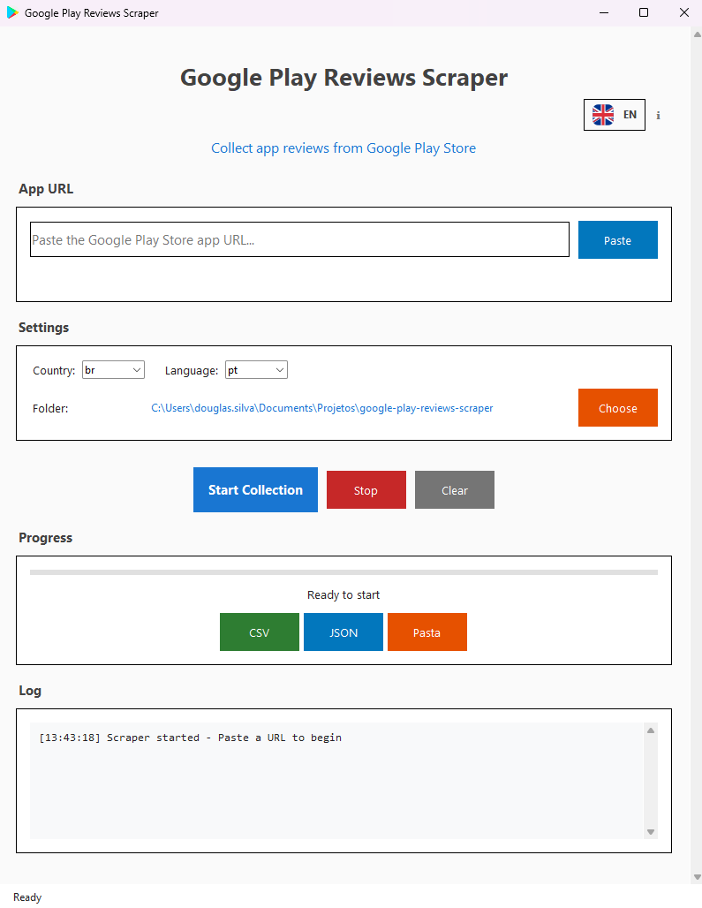

# 📱 Google Play Reviews Scraper

<div align="center">

**🌍 Language / Idioma / Langue / Sprache / Lingua**

[](README.md)
[](README_PT.md)
[](README_ES.md)
[](README_FR.md)
[](README_DE.md)
[](README_IT.md)

---


**Herramienta profesional para extraer y analizar reseñas de apps de Google Play Store**

[](https://python.org)
[](LICENSE)
[](https://windows.microsoft.com)

</div>

---

## 🎯 **¿Qué hace?**

Extrae **TODAS** las reseñas disponibles de cualquier app de Google Play Store de forma rápida, organizada y confiable. Ideal para:

- 📊 **Análisis de mercado** y competencia
- 🔍 **Investigación de UX** y feedback de usuarios  
- 📈 **Monitoreo** de reputación de apps
- 🎯 **Insights** para desarrollo de productos
- 📋 **Informes** y presentaciones

---

## 🚀 **Instalación Rápida**

### 🖥️ **Compatibilidad de Plataformas**

| Plataforma | Interfaz Gráfica | Línea de Comandos | Ejecutable |
|------------|------------------|-------------------|------------|
| 🪟 **Windows** | ✅ Soporte completo | ✅ Soportado | ✅ Disponible |
| 🍎 **macOS** | ❌ Solo terminal | ✅ Soportado | ❌ No disponible |
| 🐧 **Linux** | ❌ Solo terminal | ✅ Soportado | ❌ No disponible |

> **Nota**: La interfaz gráfica está disponible solo para Windows. Los usuarios de Mac y Linux deben usar la versión de línea de comandos.

### Opción 1: Ejecutable (Solo Windows)
1. Descarga el ejecutable de la [página de releases](../../releases)
2. Ejecuta `GooglePlayReviewScraper.exe`
3. ¡Listo! No necesitas instalar Python

### Opción 2: Código Fuente (Todas las Plataformas)
```bash
# Clona el repositorio
git clone https://github.com/tu-usuario/google-play-reviews-scraper.git
cd google-play-reviews-scraper

# Instala las dependencias
pip install -r requirements.txt

# Windows: Ejecuta la interfaz gráfica
python app_gui.py

# Mac/Linux: Usa la línea de comandos
python review_scraper.py --url "https://play.google.com/store/apps/details?id=com.whatsapp"
```

**Usuarios Windows**: La interfaz se abrirá en Portugués. ¡Usa el selector de banderas en la esquina superior derecha para cambiar idioma!
**Usuarios Mac/Linux**: Utiliza la interfaz de línea de comandos con los parámetros mostrados a continuación.

---

## 💻 **Interfaz Gráfica Moderna**



### 🎬 **Aplicación en Funcionamiento**


### ✨ Características de la Interfaz:
- 🎨 **Diseño Material Design** moderno e intuitivo
- 🌍 **Multi-idiomas** con selector de banderas (6 idiomas)
- 📋 **Pega la URL** directamente del navegador
- ⚙️ **Configuración simple** (país, idioma, carpeta)
- 📊 **Progreso en tiempo real** con barra visual
- 📁 **Apertura automática** de archivos generados
- 📜 **Scroll suave** para pantallas pequeñas
- ℹ️ **Modal "Acerca de"** con información del desarrollador
- 🎯 **Icono personalizado** en la barra de tareas

### 🌍 **Sistema Multi-idiomas**
- **🇺🇸 English**
- **🇧🇷 Português**
- **🇪🇸 Español** (Predeterminado)
- **🇫🇷 Français**
- **🇩🇪 Deutsch**
- **🇮🇹 Italiano**

**Selector con banderas reales**: ¡Haz clic en la bandera en la esquina superior derecha para cambiar idioma instantáneamente!

---

## 🛠️ **Interfaz de Línea de Comandos**

### 🎬 **Demostración del Terminal**


### 🍎🐧 **Para Usuarios Mac/Linux (Obligatorio)**

Como la interfaz gráfica es exclusiva para Windows, los usuarios de Mac y Linux deben usar la línea de comandos:

```bash
# Uso básico
python review_scraper.py --url "https://play.google.com/store/apps/details?id=com.whatsapp"

# Con configuraciones personalizadas
python review_scraper.py \
  --app-id "com.whatsapp" \
  --country "es" \
  --lang "es" \
  --output "whatsapp_reviews"

# Obtener ayuda
python review_scraper.py --help
```

### 🪟 **Para Usuarios Windows (Opcional)**

Los usuarios de Windows también pueden usar la línea de comandos para automatización:

```bash
# Ejemplo básico
python review_scraper.py --url "https://play.google.com/store/apps/details?id=com.whatsapp"

# Con configuraciones personalizadas
python review_scraper.py \
  --app-id "com.whatsapp" \
  --country "us" \
  --lang "en" \
  --output "whatsapp_usa_reviews"

# Ayuda completa
python review_scraper.py --help
```

### **Parámetros Disponibles:**
```
--url, -u          URL completa de la app
--app-id, -a       ID de la app (ej: com.whatsapp)
--country, -c      Código del país (predeterminado: es)
--lang, -l         Código del idioma (predeterminado: es)
--output, -o       Nombre de los archivos de salida
--help, -h         Muestra esta ayuda
```

---

## 📖 **Cómo Usar**

### 1️⃣ **Encuentra la App**
Ve a Google Play Store y encuentra la app deseada. Ejemplo:
```
https://play.google.com/store/apps/details?id=com.whatsapp
```

### 2️⃣ **Pega la URL**
- Abre Google Play Reviews Scraper
- Pega la URL completa en el campo
- El App ID se extraerá automáticamente

### 3️⃣ **Configura (Opcional)**
- **País**: `es` (España), `us` (EUA), `br` (Brasil)...
- **Idioma**: `es` (Español), `en` (Inglés), `pt` (Portugués)...
- **Carpeta**: Elige dónde guardar los archivos

### 4️⃣ **Ejecuta**
Haz clic en "Iniciar Recopilación" y espera. ¡El proceso es automático!

---

## 🌍 **Idiomas Soportados en la Interfaz**

La aplicación soporta **6 idiomas** con traducción completa de la interfaz:

| Bandera | Código | Idioma | Estado |
|---------|--------|--------|--------|
| 🇺🇸 | `en` | **English** | ✅ Completo |
| 🇧🇷 | `pt` | **Português** | ✅ Completo |
| 🇪🇸 | `es` | **Español** | ✅ Predeterminado |
| 🇫🇷 | `fr` | **Français** | ✅ Completo |
| 🇩🇪 | `de` | **Deutsch** | ✅ Completo |
| 🇮🇹 | `it` | **Italiano** | ✅ Completo |

**Cómo usar**: ¡Haz clic en la bandera en la esquina superior derecha de la interfaz para cambiar idioma instantáneamente!

### 🎯 **Lo que se traduce:**
- ✅ Todos los botones y etiquetas
- ✅ Títulos de las secciones
- ✅ Mensajes de estado y registro
- ✅ Modal "Acerca de" completo
- ✅ Placeholders y tooltips
- ✅ Mensajes de error

---

## 🚀 **Novedades de la Versión Actual**

### ✨ **Recursos Implementados**
- 🌍 **Sistema multi-idiomas completo** (6 idiomas)
- 🎨 **Interfaz Material Design** moderna y responsiva
- 🏳️ **Selector de banderas** con imágenes PNG reales (24x24px)
- 📜 **Scroll suave** para pantallas de cualquier tamaño
- 🎯 **Icono personalizado** de Google Play en la barra de tareas
- ℹ️ **Modal "Acerca de"** con información del proyecto
- 🔄 **Traducción instantánea** de toda la interfaz
- 📊 **Barras de progreso** visuales e informativas

---

<div align="center">

**Desarrollado con ❤️ por [DSiqueira](https://dsiqueira.com)**

⭐ **¡Si este proyecto fue útil, deja una estrella!** ⭐

</div>