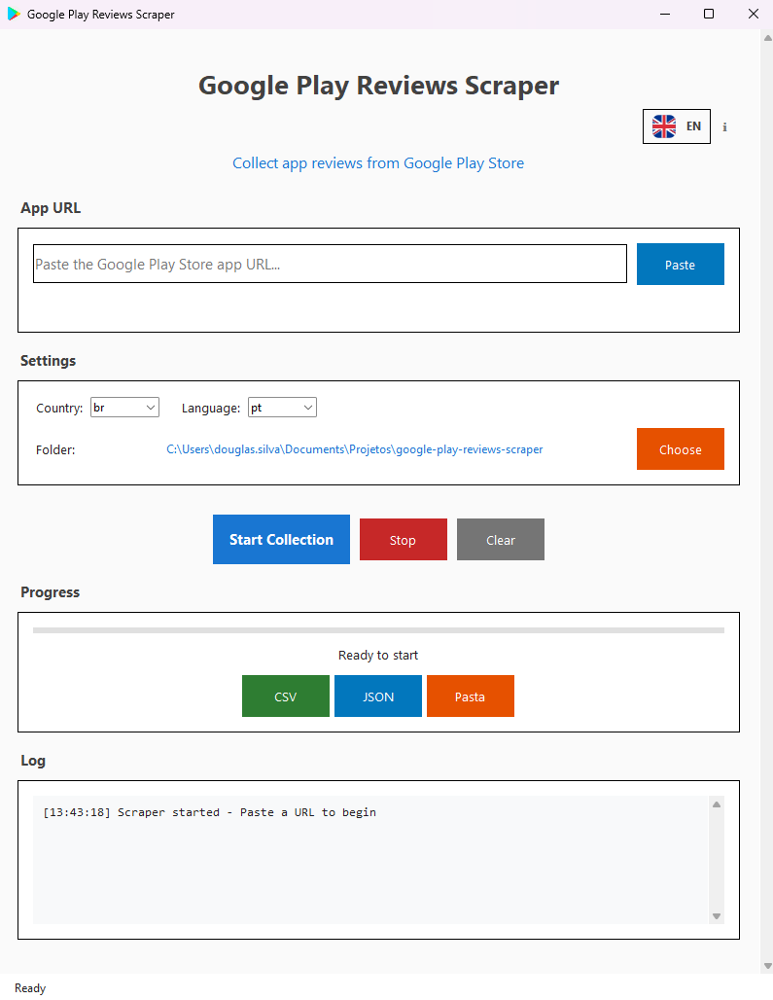

<div align="center">

# 📱 Google Play Reviews Scraper


**🚀 Strumento professionale per estrarre e analizzare recensioni di app dal Google Play Store**

*Estrai migliaia di recensioni in pochi minuti con un'interfaccia moderna e bella*

---

## � **Scegli la tua Lingua / Choose Your Language**

[](../README.md)
[](README_PT.md)
[](README_ES.md)
[](README_FR.md)
[](README_DE.md)
[](README_IT.md)

---

[](https://python.org)
[](../LICENSE)
[](https://github.com)
[](../src/app_gui.py)

**[� Vedi Demo](#-demo) • [⚡ Avvio Rapido](#-avvio-rapido) • [📖 Caratteristiche](#-caratteristiche) • [🛠� Installazione](#�-installazione)**

---

</div>

## � Demo

<div align="center">

### 🖥� Interfaccia Moderna
*Interfaccia bella e intuitiva con supporto multi-lingua*



### âš¡ Applicazione in Azione
*Vedi il scraper funzionare con progresso in tempo reale*


### 📊 Interfaccia a Riga di Comando
*Disponibile anche via terminale per automazione*


</div>

---

## � **Cosa fa?**

Estrae **TUTTE** le recensioni disponibili da qualsiasi app del Google Play Store in modo rapido, organizzato e affidabile. Ideale per:

- 📊 **Analisi di mercato** e ricerca della concorrenza
- � **Ricerca UX** e analisi del feedback degli utenti  
- 📈 **Monitoraggio** della reputazione delle app
- � **Insights** per lo sviluppo di prodotti
- 📋 **Report** e presentazioni

---

## 🚀 **Installazione Rapida**

### 🖥� **Compatibilità delle Piattaforme**

| Piattaforma | Interfaccia Grafica | Riga di Comando | Eseguibile |
|-------------|---------------------|-----------------|------------|
| 🪟 **Windows** | ✅ Supporto completo | ✅ Supportato | ✅ Disponibile |
| � **macOS** | ✅ **NUOVO!** Interfaccia Nativa | ✅ Supportato | � Non disponibile |
| � **Linux** | � Solo terminale | ✅ Supportato | � Non disponibile |

> **✨ NUOVO**: macOS ora ha un'interfaccia visuale nativa con 6 lingue e design nativo!

### Opzione 1: Eseguibile (Solo Windows)
1. Scarica l'eseguibile dalla [pagina delle release](../../releases)
2. Esegui `GooglePlayReviewScraper.exe`
3. Fatto! Non è necessario installare Python

### Opzione 2: Interfaccia Visuale (Windows & macOS)
## âš¡ Avvio Rapido

### � **Opzione 1: Applicazione GUI (Consigliata)**

```bash
# 1. Clonare il repository
git clone https://github.com/dssiqueira/google-play-reviews-scraper.git
cd google-play-reviews-scraper

# 2. Installare le dipendenze
pip install -r requirements.txt

# 3. Avviare la GUI
python src/app_gui.py
```

### 🔧 **Opzione 2: Riga di Comando**

```bash
# Estrarre recensioni da una singola app
python src/review_scraper.py --url "https://play.google.com/store/apps/details?id=com.whatsapp"

# Elaborazione in batch di più app
python src/review_scraper.py --batch lista_app.txt --output risultati/
```

### 📦 **Opzione 3: Modulo Python**

```python
from src.review_scraper import GooglePlayReviewScraper

scraper = GooglePlayReviewScraper()
reviews = scraper.scrape_reviews("com.whatsapp")
print(f"{len(reviews)} recensioni estratte!")
```

---

## 📖 Caratteristiche

<div align="center">

| � **Caratteristiche Principali** | � **Interfaccia** | 📊 **Output** | � **Multi-Lingua** |
|:---:|:---:|:---:|:---:|
| Estrae **TUTTE** le recensioni | GUI moderna con temi | Esportazione CSV e JSON | 6 lingue supportate |
| **Elaborazione in batch** | Progresso tempo reale | Analisi dettagliate | Auto-rilevamento lingua |
| **Filtraggio intelligente** | Drag & drop URL | Statistiche tempo | Traduzioni personalizzate |
| **Limitazione velocità** | Coda multi-app | Gestione errori | Supporto RTL |

</div>

### 🚀 **Cosa lo rende speciale?**

- **� Estrazione Completa**: Ottiene TUTTE le recensioni disponibili, non solo quelle recenti
- **⚡ Super Veloce**: Scraping ottimizzato con limitazione intelligente della velocità  
- **� Interfaccia Bella**: GUI moderna con temi chiaro/scuro
- **📊 Analisi Ricche**: Statistiche dettagliate e tracciamento del tempo
- **🔄 Elaborazione in Batch**: Gestisce più app simultaneamente
- **� Multi-Lingua**: Interfaccia disponibile in 6 lingue
- **📱 Rilevamento Intelligente**: Auto-rileva info app e gestisce errori elegantemente
- **💾 Formati Multipli**: Esporta in CSV, JSON con campi personalizzabili
- **🛡� Robusto**: Gestisce problemi di rete, limiti di velocità e casi estremi

---

## 🛠� Installazione

### 📋 **Requisiti**

- **Python 3.7+** (3.9+ consigliato)
- **Connessione internet** per lo scraping
- **2GB RAM** minimo (4GB+ per grandi dataset)

### 📦 **Installazione Rapida**

```bash
git clone https://github.com/dssiqueira/google-play-reviews-scraper.git
cd google-play-reviews-scraper
pip install -r requirements.txt
python src/app_gui.py
```
- 📊 **Progresso in tempo reale** con barra visuale
- � **Apertura automatica** dei file generati
- 📜 **Scorrimento fluido** per schermi piccoli
- ℹ� **Modal "Informazioni"** con informazioni dello sviluppatore
- � **Icona personalizzata** nella barra delle applicazioni

### � **Sistema Multi-lingua**
- **🇺🇸 English**
- **🇧🇷 Português**
- **🇪🇸 Español**
- **🇫🇷 Français**
- **🇩🇪 Deutsch**
- **🇮🇹 Italiano** (Predefinito)

**Selettore con bandiere reali**: Clicca sulla bandiera nell'angolo in alto a destra per cambiare lingua istantaneamente!

---

## 🛠� **Interfaccia a Riga di Comando**

### � **Dimostrazione del Terminal**


### �� **Per Utenti Mac/Linux (Obbligatorio)**

Poiché l'interfaccia grafica è esclusiva per Windows, gli utenti Mac e Linux devono utilizzare la riga di comando:

```bash
git clone https://github.com/dssiqueira/google-play-reviews-scraper.git
cd google-play-reviews-scraper
pip install -r requirements.txt
python src/app_gui.py
```

---

## � Casi d'Uso

### 💼 **Perfetto per:**

- **📊 Ricercatori di Mercato** - Analizzare app concorrenti e tendenze di mercato
- **� Product Manager** - Raccogliere feedback utenti per pianificazione funzionalità  
- **� Ricercatori UX** - Comprendere punti dolenti e preferenze utenti
- **📈 Sviluppatori App** - Monitorare performance e soddisfazione utenti
- **� Analgisti Business** - Generare insights per decisioni strategiche
- **� Studenti e Accademici** - Raccogliere dati per progetti di ricerca

---

## ?? Licenza

Questo progetto è sotto licenza **MIT** - vedi il file [LICENSE](../LICENSE) per i dettagli.

---

<div align="center">

**?? Sviluppato con ?? per la comunità**

**Se questo progetto ti ha aiutato, considera di dargli una ?!**

[](../../stargazers)
[](../../network/members)

</div>
